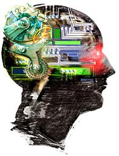
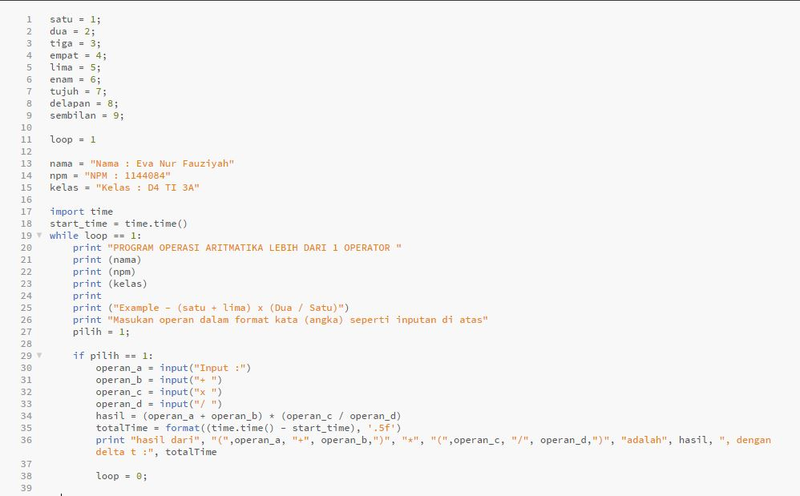
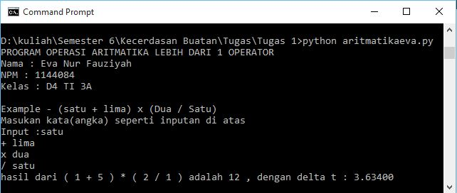

<h2 align="center">PENDAHULUAN KECERDASAN BUATAN - Pertemuan ke-1 KECERDASAN BUATAN </h2>

 

 

<strong>PEMBUKAAN</strong> 
<b>Latar Belakang</b> 
Sebelum lebih lanjut ke praktek dalam membuat suatu program yang dibuat berdasarkan kecerdasan buatan yang dibuat programmer, alangkah baiknya kita harus memahami apa itu arti kecerdasan buatan baik dalah segi harfiah atau pengertian umum. Kita harus memahami dan mengerti apa itu kecerdasan buatan. Adapun penjelasannya adalah sebagai berikut: 

<strong>ISI</strong> 
Dalam segi harfiah kecerdasan buatan itu terdiri dari dua kata dasar, yaitu yang pertama adalah cerdas, dan yang kedua adalah buatan. 
<b>Cerdas</b> bisa diartikan dengan cepat dalam arti ia berdasarkan ukuran waktu (delta t) dan proses. Selain itu cerdas juga dapat diartikan tepat, maksudnya benar dan sesuai dengan tujuan atau hasilnya. 
 
Adapun kata cepat dan tepat ini sangat berhubungan dengan kata efeiien dan efektif. 
Efisien adalah sesatu hal yang berhungan dengan waktu dan biaya.  
Contoh: Handphone yang digunakan Eva lebih efisien daripada handphone Lala. 
        Eva lebih memilih memakai jasa gojek daripada angkot. 
 
Efektif adalah sesuatu yang mengandung tujuan dan harus tercapai.
Contoh: Dengan cara mendapatkan nilai yang bagus pada saat UTS dan UAS maka hal itu efektif dalam mendapatkan nilai A dalam predikat nilai matakuliah. 
 
Maka sesuatu bisa dikatakan cerdas apabila sesuatu tersebut dikatakan efisien dan efektif. Semakin cepat maka semakin efisien dan semakin akurat ketepatan nya maka akan semakin efektif. 
Cerdas itu bukan genetik tetapi kecerdasan ada karena dilatih. 
 
Adapun kata <b>buatan</b> adalag artifisial. 
Sehingga kecerdasan buatan adalah ilmu untuk merekayasa suatu mesin agar lebih cepat dan tepat.
 
 

<b>Praktek</b> 
Membuat program untuk operasi aritmatika lebih dari satu operator dengan menggunakan python dan inputan kata angka (ex.lima, satu, dll) dengan output hasil dari perhitungan aritmatika dan delta t (t1-t0) 
 
Source Code: 

 

 

Output: 

 

 
 
<strong>PENUTUP</strong> 
<b>KESIMPULAN</b> 
Jadi, kecerdasan buatan adalah ilmu untuk merekayasa suatu mesin agar lebih cepat dan tepat. 
 
<b>SARAN</b> 
Sebelum melangkah untuk mempraktekan program yang dibuat berdasarkan kecerdasan buatan,a langkah lebih baiknya kita harus memahami dan mengerti apa itu kecerdasan buatan dan hal-hal apa saja yang dapat mempengaruhi pembuatan program berdasarkan kecerdasan buatan. 
 
Referensi : Materi Kecerdasan Buatan Pertemuan 1 tanggal 5 Maret 2017

