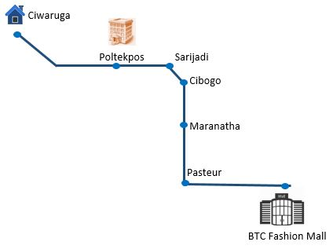
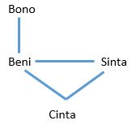
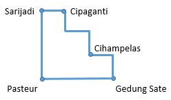
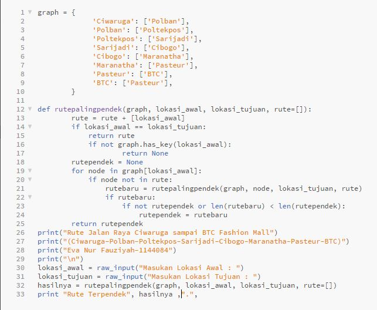
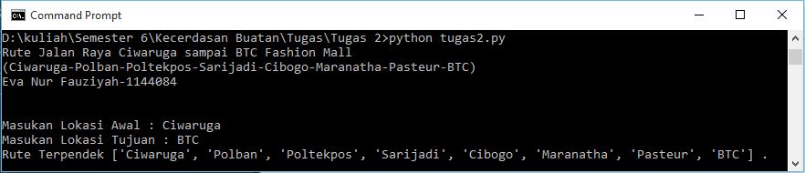

<h2 align="center">REPRESENTASI PENGETAHUAN - Pertemuan ke-2 KECERDASAN BUATAN </h2>

 

 

<strong>PEMBUKAAN</strong> 
<b>Latar Belakang</b> 
Sebuah program yang dibuat berdasarkan kecerdasan buatan yang berisi tentang pengetahuan atau informasi perlu dipaparkan dan disajikan dengan baik serta bisa dimengerti baik dalam sisi user ataupun dalam sisi mesin komputer. Untuk itu, pada kali ini kita akan membahas tentang cara menyajikan program berupa representasi pengetahuan melalui mesin dan contoh program rute jalan hasil dari representasi pengetahuan menggunakan bahasa pemrograman python. 

<strong>ISI</strong> 
Representasi pengetahuan berasal dari dua kata yaitu representasi dan pengetahuan. 
Representasi adalah gabungan dari dua kata. Yang pertama adalah re yang artinya mengulang, dan presentasi yang artinya memaparkan atau menyajikan. 
Adapun pengetahuan berasal dari kata dasar tahu. Misalkan: 
-	Eva tahu kodingan python tentang rute jalan. 
-	Eva paham kodingan python tentang rute jalan. 
Dari contoh di atas, kalimat ke 1 dan kalimat ke 2 berbeda artinya. Orang paham pasti tahu tapi orang tahu belum tentu bisa paham. Seseorang yang tahu dan ingin menjadi paham, ia harus melalui sebuah proses berpikir. Kemungkinan ketika melalui proses tersebut, sesaat akan muncul sebuah keraguan. Namun rasa ragu tersebut muncul akibat hasil dari proses berpikir. 
Contoh beberapa representasi pengetahuan dengan menyajikan pengetahuan melalui bahasa mesin: 
<i>Contoh 1</i> 
Eva Perempuan 
Untuk merepresentasikan Eva adalah pererembuan maka dibuatkanlah sebuah fungnsi dalam pemrograman karena komputer tidak mengerti bahasa manusia. Maka dibuatlah: 
Example: Perempuan(eva) 
 
<i>Contoh 2</i> 

 

 
Ortu (Bono, Beni)        x        anak (Beni, Bono) 
Ortu (Beni, Cinta)       x        anak (Cinta, Beni) 
			                      Anak (Cinta, Sinta) 
Jika ditanya: ortu(A,B)..? 
Jawabannya: 
A=Bono B=Beni 
A=Beni B=Cinta 
 
<i>Contoh 3</i> 
Peta

 

 
Mainroud (Sarijadi, Pasteur) 
Mainroud(Pasteur, Gedung Sate) 
Rowd (Cipaganti, Cihampelas) 
Rowd (Cipaganti, Cihampelas) 
Rowd (Cihampelas, Gedung Sate) 
 
Jika ditanya: Lewatmana(Cipaganti, Pasteur) 
Jawab: Rowd(Cipaganti, Sarijadi) 
Mainrowd(Sarijadi, Pasteur) 
 
 
<b>Praktek</b> 

 

 
Membuat representasi pengetahuan dari rute jalan memakai bahasa pemrograman python. Adapun kasus yang dibuat adalah rute dari Ciwaruga (rumah saya) ke tujuan BTC Fashion Mall. 
 
Source Code: 

 

 

Output: 

 

 
 
<strong>PENUTUP</strong> 
<b>KESIMPULAN</b> 
Jadi representasi pengetahuan adalah cara menyajikan pengetahuan agar pengetahuan yang manusia ketahui bisa dimengerti juga oleh bahasa mesin (kodingan). 
 
<b>SARAN</b> 
Alangkah baiknya mencoba praktek dengan contoh kasus yang lain agar bisa lebih paham tentang materi representasi pengetahuan melalui bahasa pemrograman python. 
 
Referensi : Materi Kecerdasan Buatan Pertemuan ke 2 oleh Rolly Maulana Awangga pada tanggal 14 Maret 2017.

